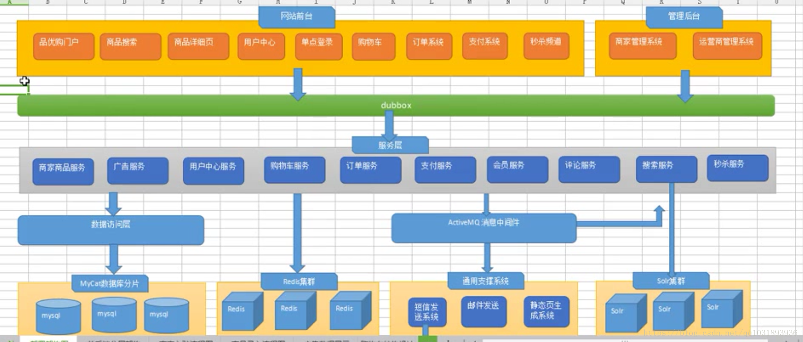

# pinyougou

## 本仓库目录介绍

- 根目录
  - sql：存放sql文件
  - repository：存放本项目需要用的依赖
  - asset：存放README文件用到的图片（不用理会）

> 其他目录均为代码目录

## 项目介绍

> 品优购网上商城是一个综合性的 B2B2C 平台，类似京东商城、天猫商城。网站采用商家入驻的模式，商家入驻平台提交申请，有平台进行资质审核，审核通过后，商家拥有独立的管理后台录入商品信息。商品经过平台审核后即可发布。
>
> 品优购网上商城主要分为网站前台、运营商后台、商家管理后台三个子系统。
>
> **某马java实战项目**

### 网站前台

- 网站首页
- 商家首页
- 商品详细页
- 搜索页
- 会员中心
- 订单与支付相关页面

### 运营商后台

- 商家审核
- 品牌管理
- 规格管理
- 模板管理
- 商品分类管理
- 商品审核
- 广告类型管理
- 广告管理
- 订单查询
- 商家结算

### 商家后台

- 商品管理
- 订单查询统计
- 资金结算

> **注意**
>
> 上方列出的功能本仓库并未实现所有功能，但大部分功能均完成。

## 系统架构

## 数据表

| 表名称                  | 含义                         |
| ----------------------- | ---------------------------- |
| tb_brand                | 品牌信息表                   |
| tb_specification        | 商品规格信息表               |
| tb_specification_option | 规格选项表                   |
| tb_type_template        | 类型模板：用于关联品牌和规格 |
| tb_item_cat             | 商品分类表                   |
| tb_seller               | 商家信息表                   |
| tb_goods                | 商品信息表                   |
| tb_goods_desc           | 商品详情表                   |
| tb_item                 | 商品明细                     |
| tb_content              | 广告信息表                   |
| tb_content_category     | 广告类型表                   |
| tb_user                 | 用户表                       |
| tb_order                | 订单总表                     |
| tb_order_item           | 订单明细表                   |
| tb_pay_log              | 支付日志表                   |

## 技术选型

### 后端

- Spring
- Spring MVC
- Mybatis
- Dubbox
- Spring Security
- Spring Data Redis/Solr
- CAS（第三方单点登陆系统）
- Spring boot（只有短信模块用到）
- ActiveMQ（消息中间件）

### 前端

- Angular JS 1
- bootstrap

